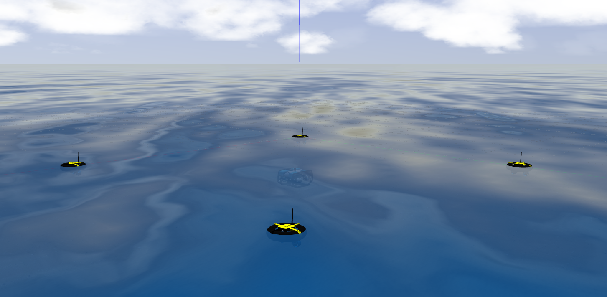

# Aqua GPS

This repository contains an underwater gps system and necessary launch files to
simulate on [Unmanned Underwater Vehicle Simulator (UUV Simulator)](https://github.com/uuvsimulator/uuv_simulator).

This work is in development at [Ingeniarius, Lda.](http://ingeniarius.pt/) and [Instituite of Systems and Robotics University of Coimbra](https://www.isr.uc.pt/) within the scope of MS thesis "Localization of an unmanned underwater vehicle using multiple water surface robots, multilateration, and sensor data fusion".

<p align="center">
  
</p>


## Requirements

- git
- [ros-\*-desktop-full](http://wiki.ros.org/ROS/Installation)
  - kinetic or newer
- [UUV Simulator](https://uuvsimulator.github.io/)
- [BlueROV2](https://github.com/fredvaz/bluerov2/tree/bluerov2_no_beacon)
- [Minion USV](https://github.com/fredvaz/minion_usv)


## Installation 

Clone this package in the `src` folder of you catkin workspace

```
cd ~/catkin_ws/src
git clone https://github.com/fredvaz/aqua_gps.git
```

and then build your catkin workspace

```bash
cd ~/catkin_ws
catkin_make # or <catkin build>, if you are using catkin_tools
```

## Running with UUV Simulator

To run a demonstration with the vehicle with teleoperation, you can run a UUV
simulator Gazebo scenario, such as

and then

```bash
roslaunch aqua_gps_demo start_aqua_gps_demo.launch move:=true record:=true bag_suffix:=Helical 
```

```bash
roslaunch aqua_gps_localization start_aqua_gps.launch rviz:=true play:=true bag:=Sim_Helical 
```

## License

Minion USV package is open-sourced under the Apache-2.0 license. See the
[LICENSE](LICENSE) file for details.
